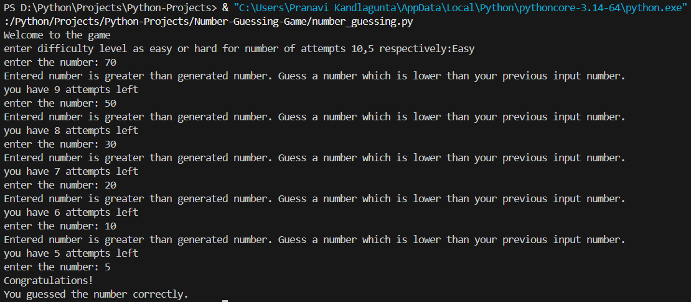

# Number Guessing Game

A Python-based number guessing game where the player tries to guess a randomly generated number between 1 and 100 within a limited number of attempts.

## Features

- Random number generation
- Two difficulty levels:
  - Easy (10 attempts)
  - Hard (5 attempts)
- Hint after every incorrect guess
- Displays the correct number when all attempts are used
## Output

